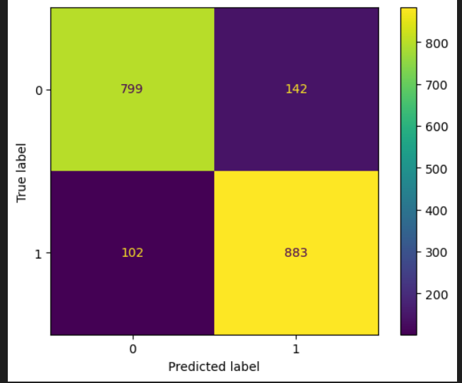

# Covid Fake News Analysis

## Table of Content
  * [Results](#results)
  * [Synopsis](#synopsis)
  * [Appendix](#appendix)
  * [Links](#links)
  * [Directory Tree](#directory_tree)
  * [Features](#features)
  * [Run Locally](#run_locally)
  * [License](#license)
  * [Technology Used](#technology_used)

## Results

| Method Used      | Result                              | 
| :---             | :----:                              |   
| CLASSIFICATION REPORT      |  | 


## Synopsis

COVID Fake News is used to classify the real news from fake news, this data consists of all the real and fake news about Covid 19 that is spread on Twitter, and in this project, I have built a classification model to find the real news from those fake news and vice versa. Here, I have used various models, and the best is considered to proceed with the classification of the news. The data consists of the tweeted news and the label specifying whether the news is fake or real.

So based on the given data,
#### Independent variable (X): Tweet news
#### Dependent variable (Y): Label value

Based on the given data we can identify this as a classification problem, so we can use various machine learning problems to solve this problem which are as follows:

    Logistic regression
    Naive Bayes
    Passive Aggressive Algorithm
    Support Vector Classifier

Based on the accuracy considered, Support Vector Classifier is considered to proceed with the classification.

Machine learning models : Support Vector Classifier

Data preprocessing : Pandas, NLTK

Data visualization : Matplotlib

## Appendix

The requirement for developing this model is present in [requirements.txt](https://github.com/Vedakeerthi/Covid-Fake-news-analysis/blob/main/requirements.txt) file.

The development of the model is present in [main.ipynb](https://github.com/Vedakeerthi/Covid-Fake-news-analysis/blob/main/Covid%20Fake%20News%20Analysis.ipynb) file.

## Links

 - #### Dataset link : https://github.com/Vedakeerthi/Covid-Fake-news-analysis/blob/main/Data.xlsx
 - #### Github link : https://github.com/Vedakeerthi/Covid-Fake-news-analysis/tree/main
 
## Directory Tree <a name='directory_tree'></a>

```
├── Classification_report.png
├── Covid Fake News Analysis.ipynb
├── Data.xlsx
├── Fake news Word cloud.jpg
├── LICENSE
├── README.md
├── Real news Word cloud.jpg
├── The most fake news repeated.png
├── The most real news repeated.png
├── requirements.txt
```
 
## Features

- Real-time monitoring of Twitter feeds for COVID-19-related news.
- Adjustable threshold for classifying news as fake or real.
- Reporting and tracking system for identified fake news.

## Run Locally <a name='run_locally'></a>

Clone the project

```bash
  git clone https://github.com/Vedakeerthi/Covid-Fake-news-analysis.git
```

Install dependencies

```bash
  pip install -r requirements.txt
```

Start the server and run the file

```bash
  python Covid Fake News Analysis.ipynb
```

## License

[](https://github.com/Vedakeerthi/Covid-Fake-news-analysis/blob/main/LICENSE)

## Technology Used <a name='technology_used'></a>

<a href="https://www.python.org" target="_blank" rel="noreferrer">  </a> &nbsp;
<a href="https://scikit-learn.org/" target="_blank" rel="noreferrer">  </a> &nbsp;
<a href="https://matplotlib.org/" target="_blank" rel="noreferrer">  </a> &nbsp;

